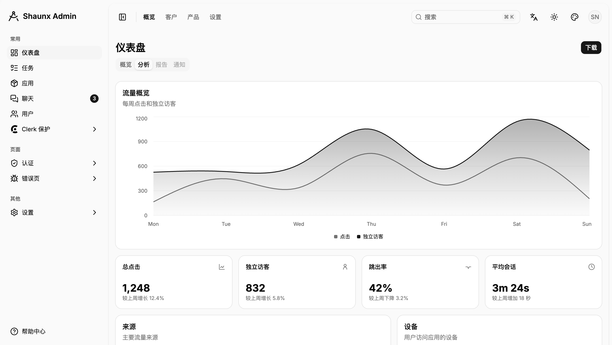
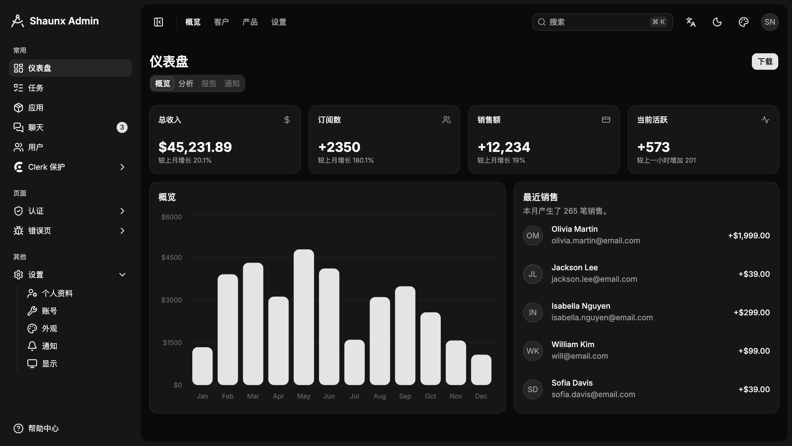
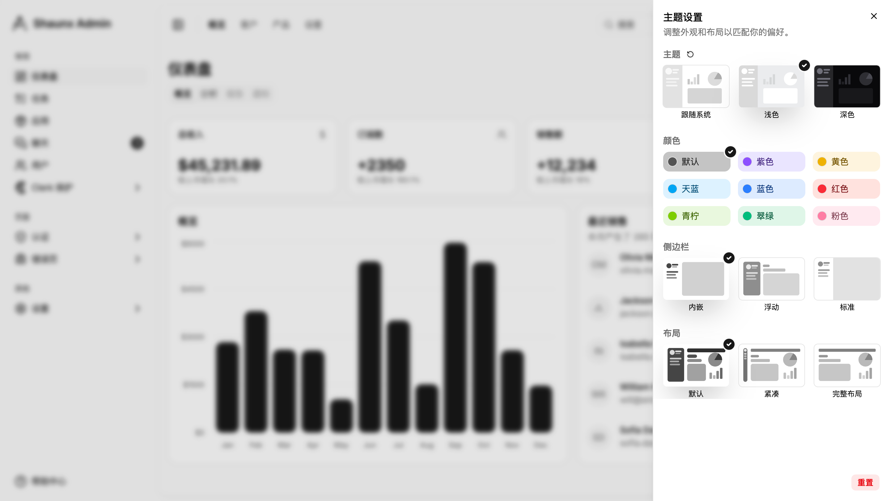
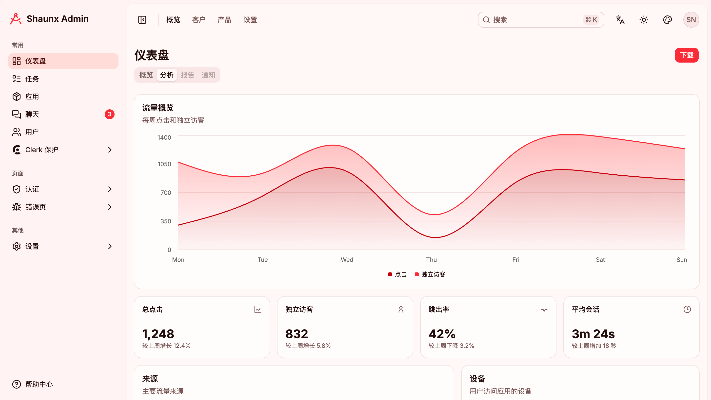
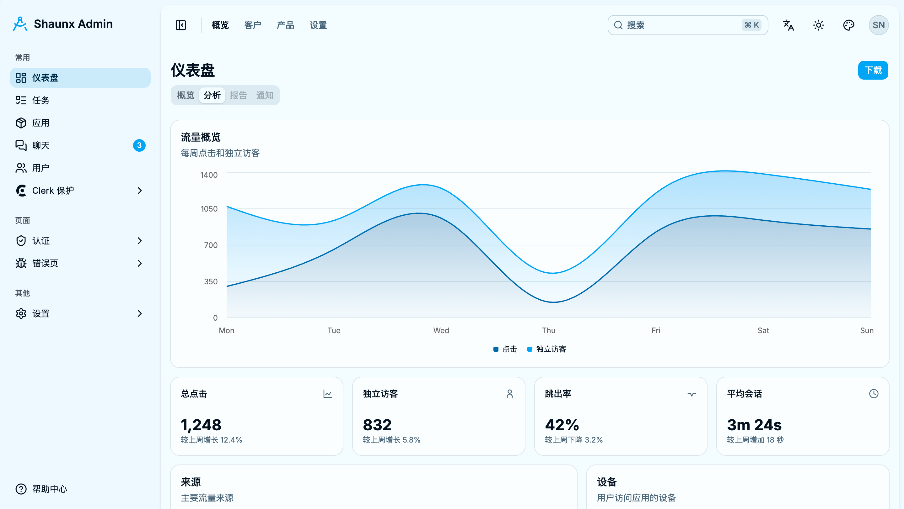
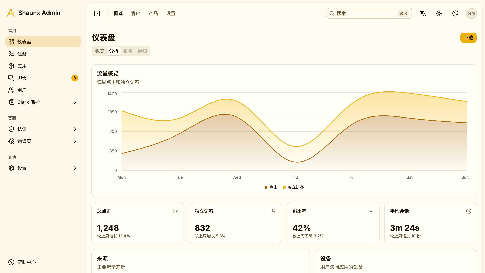
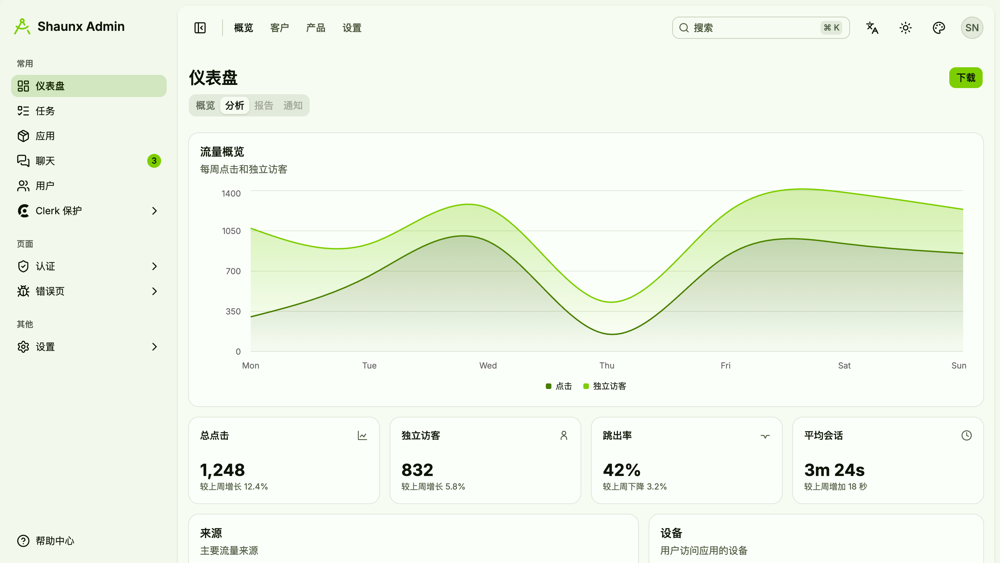
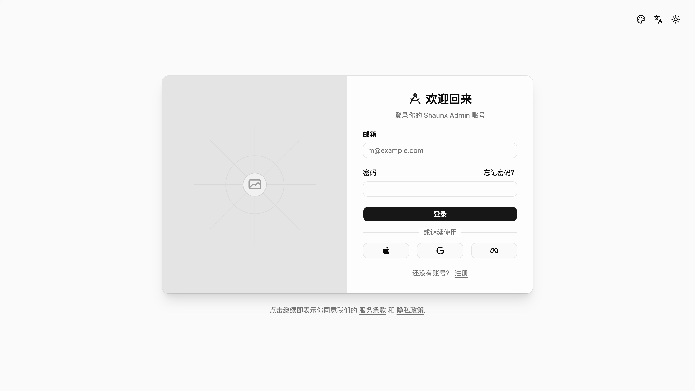
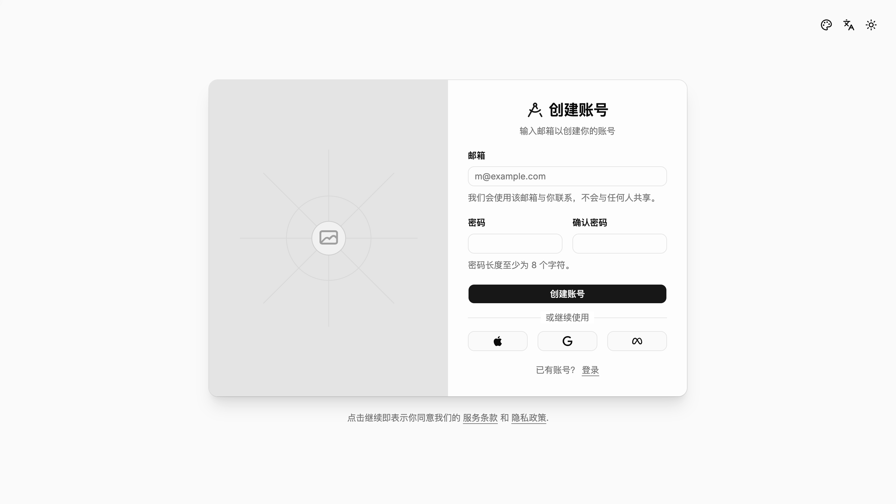

# Shaunx Admin

基于 Vite、React、TypeScript、Tailwind CSS v4 和 shadcn/ui `radix-nova` 风格构建的后台管理系统脚手架。

项目目标是提供一套开箱即用的管理端基础界面：保留常见后台功能模块，同时尽量使用 shadcn/ui 官方组件、官方设计 token 和语义化样式，方便后续按业务快速扩展。

## 项目来源

本项目的功能结构和页面场景参考自 [satnaing/shadcn-admin](https://github.com/satnaing/shadcn-admin)。

在此基础上，Shaunx Admin 使用新版 shadcn/ui `radix-nova` 风格重新整理了组件样式、主题 token、圆角、菜单、登录注册页、图表和多主题配色，目标是在保留原后台功能覆盖面的同时，提供更贴近当前 shadcn/ui 官方默认风格的脚手架。

## 预览

### Light



### Dark



### Theme Colors

| Default | Blue | Pink |
| --- | --- | --- |
|  |  |  |

| Violet | Red | Sky |
| --- | --- | --- |
|  |  |  |

| Yellow | Lime | Emerald |
| --- | --- | --- |
|  |  |  |

### Auth Screens

| Sign In | Sign Up |
| --- | --- |
|  |  |

## 特性

- Vite + React 19 + TypeScript
- shadcn/ui `radix-nova` 组件风格
- Tailwind CSS v4 与 CSS Variables 主题系统
- TanStack Router 文件路由
- TanStack Query 数据请求状态管理
- TanStack Table 数据表格能力
- Recharts + shadcn/ui Chart 图表组件
- i18next 多语言支持
- next-themes 明暗模式切换
- 多主题色切换
- lucide-react 图标体系
- 登录、注册、找回密码、OTP 等认证页面
- 仪表盘、用户、任务、聊天、应用、设置、错误页等后台页面

## 内置页面

- Dashboard: 指标卡片、趋势图、柱状图等数据概览
- Users: 用户列表、筛选、表格操作
- Tasks: 任务列表、状态、优先级与表格筛选
- Chats: 聊天列表与消息界面
- Apps: 应用入口展示
- Settings: 账号、外观、显示、通知等设置页
- Auth: 登录、注册、忘记密码、OTP
- Errors: 401、403、404、500、503 等错误页

## 技术栈

| 类型 | 技术 |
| --- | --- |
| 构建工具 | Vite |
| UI 框架 | React |
| 类型系统 | TypeScript |
| 样式 | Tailwind CSS v4 |
| 组件 | shadcn/ui |
| 路由 | TanStack Router |
| 请求状态 | TanStack Query |
| 表格 | TanStack Table |
| 图表 | Recharts |
| 表单 | React Hook Form + Zod |
| 国际化 | i18next + react-i18next |
| 图标 | lucide-react |

## 快速开始

安装依赖：

```bash
pnpm install
```

启动开发服务：

```bash
pnpm dev
```

构建生产版本：

```bash
pnpm build
```

本地预览构建结果：

```bash
pnpm preview
```

## 常用脚本

```bash
pnpm dev        # 启动开发环境
pnpm build      # 类型检查并构建
pnpm lint       # 运行 ESLint
pnpm typecheck  # 运行 TypeScript 类型检查
pnpm format     # 格式化 TS/TSX 文件
pnpm preview    # 预览 dist 构建产物
```

## 目录结构

```txt
src
├── components        # 通用组件、布局组件和 shadcn/ui 组件
├── context           # 主题、语言、布局等 Provider
├── features          # 按业务模块组织的页面功能
├── hooks             # 通用 Hooks
├── lib               # 工具函数、错误处理、i18n、主题配置
├── routes            # TanStack Router 文件路由
├── stores            # Zustand 状态
├── App.tsx
├── index.css         # Tailwind v4 与主题 token
└── main.tsx
```

## 主题与样式

项目使用 shadcn/ui 的 `radix-nova` 风格，主题变量集中维护在 `src/index.css`。

当前内置能力：

- 明暗模式切换
- 多主题色切换
- 图表色阶随主题变化
- 组件圆角、边框、背景等尽量沿用 shadcn/ui 默认 token

添加或更新 shadcn/ui 组件时，建议使用项目包管理器执行：

```bash
pnpm dlx shadcn@latest add button
```

## 环境变量

Clerk 示例路由需要配置发布密钥：

```bash
VITE_CLERK_PUBLISHABLE_KEY=YOUR_PUBLISHABLE_KEY
```

如果不使用 Clerk 示例，可以忽略相关路由或按业务替换认证逻辑。

## 开发约定

- 优先使用 `src/components/ui` 中的 shadcn/ui 官方组件
- 优先使用 `bg-background`、`text-foreground`、`text-muted-foreground`、`bg-primary` 等语义 token
- 避免在业务组件中硬编码颜色、圆角和阴影
- 页面功能放在 `src/features`，路由入口放在 `src/routes`
- 新增主题色时同步更新 `--primary`、`--ring`、`--chart-*` 和侧边栏相关 token

## License

Licensed under the [MIT License](./LICENSE).

This project is based on and inspired by [satnaing/shadcn-admin](https://github.com/satnaing/shadcn-admin), which is also licensed under the MIT License.
